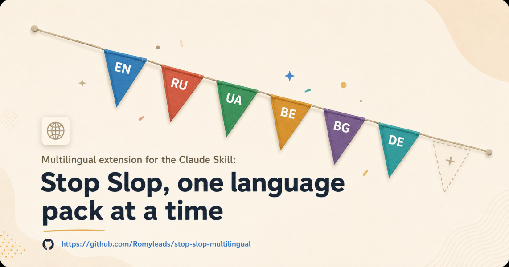

# Stop Slop — multilingual


A Claude Skill that catches predictable AI writing patterns before they ship — now in six languages, with room for more.



## The problem

Text written by an LLM has a recognizable shape, in any language: throat-clearing openers, formulaic contrasts, meta-commentary, and a rhythm that's a little too even. Once you've seen the pattern, it's hard to unsee — and it reads as generic rather than considered, no matter how good the underlying idea is.

> **Before:** «Важно отметить, что дело не в технологии, а в людях. Это не просто сложность, это фундаментальная проблема.»
> **After:** «Технология — управляемая. Люди — нет.»

This skill gives Claude a concrete checklist to catch that pattern and rewrite around it — instead of a vague instruction like "sound more human."

## Before / after

| Language | Before | After | What changed |
|---|---|---|---|
| Russian | «Важно отметить, что команда столкнулась с рядом сложностей.» | «Команда упёрлась в три конкретные проблемы: бюджет, сроки, согласования.» | Cut the throat-clearing opener, named the vague "ряд сложностей." |
| Russian | «Дело не в бюджете. Дело в приоритетах.» | «Приоритеты, а не бюджет, определяют, что мы делаем в первую очередь.» | Removed the formulaic "Дело не в X. Дело в Y." contrast, stated the claim directly. |
| Ukrainian | «Варто зазначити, що це не тільки технічна, а й організаційна проблема.» | «Проблема організаційна так само, як і технічна.» | Cut the opener and the additive hedge "не тільки... а й." |
| Ukrainian | «Підсумовуючи, можна сказати, що результати в цілому позитивні.» | «Результати позитивні: конверсія виросла на 12%.» | Removed the unrequested summary opener, replaced "в цілому" with the actual number. |

More examples per language live in [references/locales](references/locales/) — each locale file follows the same before/after format as it grows.

## How to use it

1. Pick the language combination you need from the [table below](#language-packages).
2. Download that one `.zip` from [Releases](../../releases/latest).
3. Install it:
   - **claude.ai / Desktop / Cowork:** Settings → Skills → **+ Create skill** → upload the `.zip`. No terminal.
   - **Claude Code:** unzip into `~/.claude/skills/<package-name>/` (all your projects) or `.claude/skills/<package-name>/` (this project only), then restart.
   - **Claude Projects:** upload the package's `SKILL.md` and `references/` files to project knowledge.
   - **API:** include `SKILL.md` in your system prompt; Claude reads the matching reference file on demand.
4. Write normally. The skill triggers automatically when you ask Claude to draft, edit, or review text — you don't need to invoke it by name.

## Language packages

_Last updated: 2026-07-20 — see [SYNC_STATUS.md](SYNC_STATUS.md) for per-update history._

Each package below is self-contained: install `ru` and you get zero English or Ukrainian content taking up space in that skill — just the language you asked for.

| | Package | Contains | Download |
|---|---|---|---|
| 🟦 | `stop-slop-en-ru-ua` | English + Russian + Ukrainian | [.zip](../../releases/latest/download/stop-slop-en-ru-ua.zip) |
| 🟥 | `stop-slop-ru` | Russian only | [.zip](../../releases/latest/download/stop-slop-ru.zip) |
| 🟩 | `stop-slop-ua` | Ukrainian only | [.zip](../../releases/latest/download/stop-slop-ua.zip) |
| 🟧 | `stop-slop-by` | Belarusian only — draft, see [status](#relationship-to-upstream) | [.zip](../../releases/latest/download/stop-slop-by.zip) |
| 🟪 | `stop-slop-bg` | Bulgarian only — draft | [.zip](../../releases/latest/download/stop-slop-bg.zip) |
| 🟦 | `stop-slop-de` | German only — starter set, unreviewed | [.zip](../../releases/latest/download/stop-slop-de.zip) |
| 🟦 | `stop-slop-en-de` | English + German | [.zip](../../releases/latest/download/stop-slop-en-de.zip) |
| ⬜ | `stop-slop-ru-ua` | Russian + Ukrainian, no English | [.zip](../../releases/latest/download/stop-slop-ru-ua.zip) |
| ⬜ | `stop-slop-en-ru-ua-be-bg-de` | English + Russian + Ukrainian + Belarusian + Bulgarian + German — every language currently in this repo, named explicitly rather than called "full" (we don't cover all languages, so that name would mislead) | [.zip](../../releases/latest/download/stop-slop-en-ru-ua-be-bg-de.zip) |
| ➕ | *your combination* | e.g. Polish, or Spanish + English | [open an issue](../../issues/new) or add a row to `build/manifest.yml` and open a PR |

Install **one** package. Adding a second one of ours on top just duplicates the same rules for no benefit — see [Language packages](#language-packages) note above before mixing.

Note on the table above: the colored squares are just visual anchors matching the banner, not flags — deliberately, so the project doesn't put national symbols next to each other in a way nobody asked for.

## What it catches

**Every language:** active voice, specificity over vague declaratives, varied rhythm, direct statements, no pull-quote lines. See [references/core-method.md](references/core-method.md).

**English:** the original banned-phrase and structural-cliché lists. See [references/phrases.md](references/phrases.md) / [references/structures.md](references/structures.md) — unmodified from upstream.

**Russian / Ukrainian:** throat-clearing openers, empty intensifiers, formulaic contrasts, meta-summaries, vague quantifiers — plus a note on why the English "no em dash" rule doesn't transfer as-is (the dash is grammatically required in some constructions in both languages). See [references/locales/ru.md](references/locales/ru.md), [references/locales/uk.md](references/locales/uk.md).

**Belarusian / Bulgarian:** short starter lists, explicitly flagged as drafts pending native-speaker review. See [references/locales/be.md](references/locales/be.md), [references/locales/bg.md](references/locales/bg.md).

**German:** a starter list — more thorough than the Belarusian/Bulgarian drafts, but still not reviewed by a native speaker. Unlike Russian/Ukrainian, German doesn't drop the copula the way Russian does, so the English "no em dash" rule carries over largely unchanged rather than needing the same exception. See [references/locales/de.md](references/locales/de.md).

## Research basis

The locale content isn't pure translation-by-analogy from the English list. Where possible it's checked against actual research on how machine-generated text behaves in each language — including a case where that research *corrected* an earlier version of this repo (see [CHANGELOG-locales.md](CHANGELOG-locales.md)): banning "не X, а Y" outright was too broad, because that construction is a genuine logical operator in Russian and Ukrainian, not automatically a tell.

Highlights:
- Academic grounding: multilingual machine-generated-text detection is an active research area (SemEval-2024 Task 8, the MULTITuDE benchmark, StyloMetrix) — it validates stylometric/phrase-level detection as a real approach, even though none of these papers isolate Russian/Ukrainian/Belarusian/Bulgarian specifically yet.
- Language-specific finding: Russian text from English-trained models overuses the explicit copula "является" where natural Russian drops it ("Москва — столица", not "Москва является столицей").
- Language-specific finding: Ukrainian AI text overuses participial clauses where coordination with "і" would be more direct — the same pattern likely applies to Russian given the shared grammar.

Full source list, including what's still unverified and what's an open gap (Belarusian, Bulgarian, and German have no external grounding yet), lives in [research/bibliography.md](research/bibliography.md). That folder is deliberately **not** included in any downloadable package — `build/manifest.yml` only pulls in the specific files each package needs, so the research trail can grow as large as it needs to without costing anyone context tokens or download size. [research/DEEP-RESEARCH-PROMPT.md](research/DEEP-RESEARCH-PROMPT.md) is a reusable brief for asking other AI systems to extend this research — contributions there are welcome.

## Skill structure

```
stop-slop/
├── SKILL.md                  # English core skill (upstream, unmodified)
├── references/
│   ├── phrases.md             # English phrases to remove (upstream)
│   ├── structures.md          # English structural cliches (upstream)
│   ├── examples.md             # English before/after examples (upstream)
│   ├── core-method.md          # Language-agnostic method, shared by every package
│   ├── router.md                # How multi-language packages pick which file to read
│   └── locales/
│       ├── ru.md, uk.md         # Reviewed starter sets
│       ├── de.md                 # Starter set, medium confidence, unreviewed
│       └── be.md, bg.md         # Drafts, need native-speaker review
├── build/
│   ├── manifest.yml              # Defines every downloadable package
│   └── build_release.py          # Builds them on every GitHub release
├── .github/workflows/release.yml
├── assets/banner-stop-slop-multilingual.png
├── research/                     # Source trail; never referenced by manifest.yml, ships in zero packages
│   ├── bibliography.md
│   └── DEEP-RESEARCH-PROMPT.md
└── SYNC_STATUS.md
```

## Scoring

Same rubric as upstream, applied per language. Rate 1-10 on each:

| Dimension | Question |
|-----------|----------|
| Directness | Statements or announcements? |
| Rhythm | Varied or metronomic? |
| Trust | Respects reader intelligence? |
| Authenticity | Sounds human? |
| Density | Anything cuttable? |

Below 35/50: revise.

## Relationship to upstream and other sources

This is a fork of [hardikpandya/stop-slop](https://github.com/hardikpandya/stop-slop) (MIT). To be explicit about what's whose:

- **Unchanged from upstream:** `references/phrases.md`, `references/structures.md`, `references/examples.md`, plus the 8 Core Rules and the Scoring rubric (carried inside `references/core-method.md` and every built package's `SKILL.md`). All of it is the original author's work, reused here under the MIT license he published it with.
- **Added by this fork:** the Russian/Ukrainian/Belarusian/Bulgarian/German reference files, the language router, the build system that packages everything above into the downloadable combinations in the table, and this README's visual presentation — built independently of upstream's own banner/README design.
- **Portions of `references/locales/ru.md` and the "statistical deviation" framing in `references/core-method.md`** are adapted, with attribution, from [ilyautov/humanizer-ru](https://github.com/ilyautov/humanizer-ru) (MIT) — an independent, more mature Russian-language project doing closely related work. Where the two projects disagree (see the `ru.md` note on binary contrasts), we kept our own narrower rule and documented why rather than silently picking one.

If you're the original author of either project and see something here you'd rather we did differently, open an issue.

## Sources

<details>
<summary>Every source behind the ru/uk/de content, individually verified before use (click to expand)</summary>

Full detail with confirmed/unconfirmed status and per-source notes: [research/bibliography.md](research/bibliography.md).

**Academic / foundational**
- Wang, Y., Mansurov, J., et al. *SemEval-2024 Task 8: Multidomain, Multimodel and Multilingual Machine-Generated Text Detection.* arXiv:2404.14183
- Macko, D., Moro, R., et al. (2023). *MULTITuDE: Large-Scale Multilingual Machine-Generated Text Detection Benchmark.*
- Okulska, I., Stetsenko, D., Kołos, A., et al. (2023). *StyloMetrix: An Open-Source Multilingual Tool for Representing Stylometric Vectors.* arXiv:2309.12810
- *Authorship Attribution in Multilingual Machine-Generated Texts* (2025). arXiv:2508.01656
- Kumarage, T., Garland, J., et al. (2023). *Stylometric Detection of AI-Generated Text in Twitter Timelines.* arXiv:2303.03697
- Черкасова М. Н., Тактарова А. В. (2024). «Признаки сгенерированного текста в академическом дискурсе». *Филологические науки. Вопросы теории и практики*, 17(7). DOI: 10.30853/phil20240307

**Russian — practice and classics**
- Галь, Нора. «Слово живое и мёртвое» (1972)
- Гадеев, Камиль. «Штампы LLM. Разбираю с новой точки зрения». Habr, 2026
- 1ps.ru. «Как проверить текст на нейросети» (2024)
- awwwake.ru. «Как понять, что автор текста — нейросеть» (2024)
- Wikipedia (ru). «Признаки сгенерированности текста»
- SEOquick / Unmiss AI Detector. seoquick.com.ua — HTML/typographic artifact check (applied to all languages, not Russian-specific)

**Ukrainian — practice and dictionaries**
- rbc.ua. «5 ознак, що текст написав ШІ, а не людина» (2025)
- NV.ua. «Поширена калька з російської, якої варто уникати» (2024)
- Горох (goroh.pp.ua) — «Слововживання», aggregating «Мова – не калька», «Уроки державної мови», «Словник-антисуржик»
- UkrQualBench. github.com/grayodesa/ukrqualbench (2026)
- Станкевич, Ніна. *Вісник Львівського університету* (2020)
- Шевчук, С. В. «Моделі перекладу активних дієприкметників...» (2013)

**German — practice and one expert source**
- Wikipedia (de). *Anzeichen für KI-generierte Inhalte*
- Homepage-Helden. homepage-helden.de/journal/ki-textmuster/
- Weber, Stefan. plagiatsgutachten.com/blog/chatgpt-texte-erkennen/ — Austrian forensic-linguistics expert, independent of this project
- Korrektur.de. korrektur.de/ki-texte-erkennen-merkmale-checkliste
- Literaturcafé. literaturcafe.de/rettet-den-gedankenstrich-vor-der-ki/

**Related project**
- Утов, Ілля (Ilya Utov). humanizer-ru. github.com/ilyautov/humanizer-ru (MIT)

Deliberately excluded: sources whose existence we could not independently confirm (roughly 40% of what two separate AI deep-research passes suggested for Russian and Ukrainian turned out not to exist on inspection), and one related GitHub project whose license we could not confirm. Listed, not cited, in [research/bibliography.md](research/bibliography.md) with the reason for exclusion.

</details>

## Sync status

Tracked in [SYNC_STATUS.md](SYNC_STATUS.md): the exact upstream commit this fork is synced to, and the version of the locale content.

## Author

Original skill, English core, and Scoring rubric: [Hardik Pandya](https://hvpandya.com).
Locale packs, router, build system, and source verification: [Romyleads](https://romyleads.de).

## License

MIT, same as upstream — see [LICENSE](LICENSE). The file itself stays untouched (that's what MIT requires: the original notice ships with every copy), so to be explicit about which MIT-licensed content is whose: `SKILL.md`, `references/phrases.md`, `references/structures.md`, and `references/examples.md` are Hardik Pandya's, copyright 2025. Everything under `references/locales/`, `references/core-method.md`, `references/router.md`, `build/`, `.github/workflows/`, `assets/banner-stop-slop-multilingual.png`, and this README are this fork's own additions, also released under MIT. See [CHANGELOG-locales.md](CHANGELOG-locales.md) for the history of those additions specifically.
